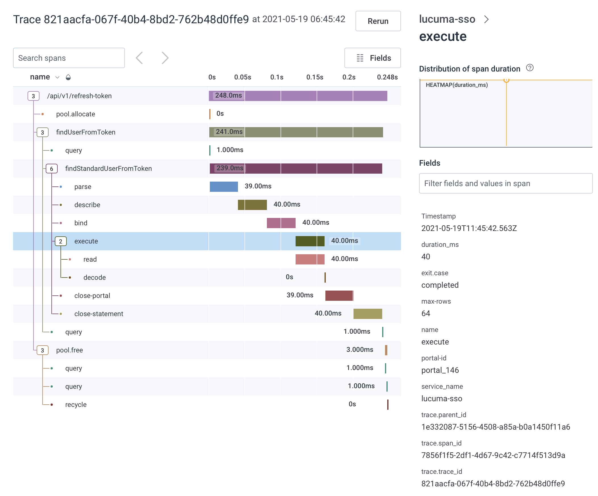

# Honeycomb

To use the [Honeycomb](https://honeycomb.io) back end, add the following dependency:

@@dependency[sbt,Maven,Gradle] {
  group="$org$"
  artifact="natchez-honeycomb_2.13"
  version="$version$"
}

## Example Trace




## Constructing an EntryPoint

The `Honeycomb.entryPoint` method takes a service name, an optional `ResponseObserver`, and a function `Options.Builder => F[Options]`, returning a `Resource[F, EntryPoint[F]]`. A minimal usage would look something like this:

```scala mdoc
import cats.effect.{ Resource, Sync }
import natchez.EntryPoint
import natchez.honeycomb.Honeycomb

def entryPoint[F[_]: Sync]: Resource[F, EntryPoint[F]] =
  Honeycomb.entryPoint[F]("my-service") { ob =>
    Sync[F].delay {
      ob.setWriteKey("<my API key>")
        .setDataset("<my dataset>")
        .build
    }
  }
```

See the examples and API reference at the [LibHoney Repository](https://github.com/honeycombio/libhoney-java) for more information on `ResponseObserver` and `Options`.

## Honeycomb Fields

Honeycomb spans include the following fields, in addition to any user-specified fields:

| Field                | Type                    | Meaning                             |
|----------------------|-------------------------|-------------------------------------|
| `service_name`       | String                  | User-supplied service name.         |
| `name`               | String                  | User-supplied span name.            |
| `trace.trace_id`     | String (UUID)           | Id shared by all spans in a trace.  |
| `trace.span_id`      | String (UUID)           | Id of the parent span, if any.      |
| `trace.parent_id`    | String (UUID, Optional) | Id of the parent span, if any.      |
| `duration_ms`        | Number                  | Span duration, in milliseconds.     |
| `exit.case`          | String                  | `completed`, `canceled`, or `error` |
| `exit.error.class`   | String (Optional)       | Exception classname, if any.        |
| `exit.error.message` | String (Optional)       | Exception message, if any.          |

