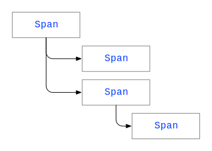
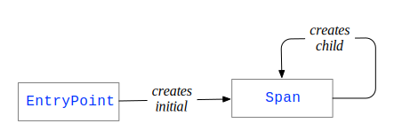

# Overview

Natchez provides interfaces that provide an abstraction for many distributed tracing back-ends. `Span`, `EntryPoint`, and `Trace` are the most important of these interfaces.

## Spans

The central interface in Natchez is the `Span`, which is a managed resource that records timing information and other details about its own lifetime. We perform computations within the lifetime of a span and thus gather timing information about these computations.

A `Span` can create child spans, whose lifetimes are bounded (usually!) by the lifetime of the parent. We can thus gather timing information for various phases of computation within a larger computation. Concurrent computations may have many active child spans.

Spans thus form a **tree**.

Each `Span` (in addition to a parent, name, intrinisic timing information, and other back-end-specific data) contains a string-keyed map of `TraceValue`s (strings, booleans, and numbers) for arbitrary user-defined information.

A `Span` can provide a hunk of data called a `Kernel`, which can be sent to a remote computer, typically via HTTP headers. The remote computer can then create child spans that will be linked with the originating span by the tracing back-end. Tracing is thus **distributed**.

See the @ref:[reference](reference/spans.md) for more information on spans.

## Entry Points

Before we can add fields to a `Span` or create child spans, we must have a span! The chicken-and-egg problem is resolved by the `EntryPoint`, which provides us with an initial span.

An initial span can be a **root span** (with no parent) or a **continued span** (with a parent on another computer). To construct a continued span we must provide the `Kernel` from a parent span, typically received via HTTP headers.

See the @ref:[reference](reference/entrypoints.md) for more information on entry points.

## Trace Constraint

We must be aware of the current `Span` if we wish to add fields or create child spans, which means we must pass the current span around.

It is perfectly fine to pass the current span around explicitly, and if you are working in a concrete effect type like `IO` this is likely the best choice. However for the increasingly common case of applications constructed in tagless style (where computations are peformed in some abstract effect) we have a `Trace` constraint that ensures an ambient span is always available.

Given an effect `F[_]: Trace` we can add fields to the ambient span, gets its kernel, or run a computation in a child of the ambient span. The `Span` instance itself is inaccessible.

See the @ref:[reference](reference/trace.md) for more information on the `Trace` constraint.
